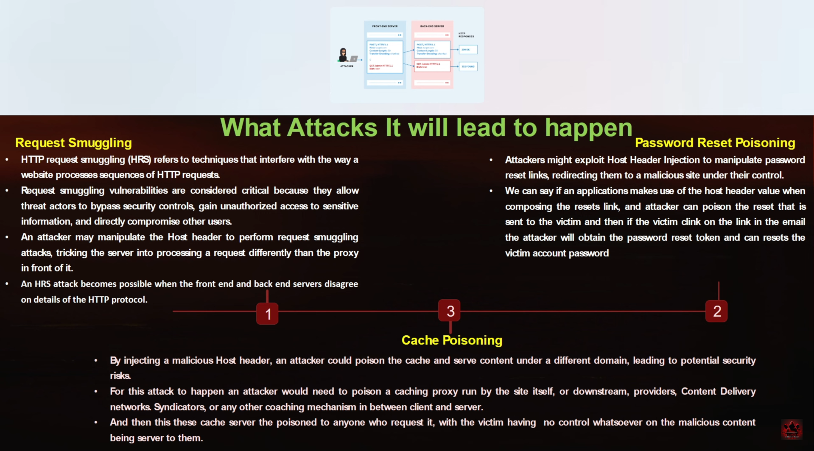

# Host Header Injection & URL Redirection Attacks
- It is a third piece of information which is used in addition to IP address and  port number to uniquely identify a web domain.
- Microsoft calls it an application server.
- It is a common practice for the same web server to host several websites or web applications on the same IP Address. That is why the host headers exits.
- It Specifies which website or web applications should process an incoming HTTP Requests. The web server uses the value of this header to dispatch the request to the specified website or web applications.
- We can say each web applications hosted on the Same IP address is commonly referred to as a virtual host. 
- We can exploit this using web — cache poisoning or by using abusive

##### Mitigations
1. Input Validation
2. Security Headers
3. Whitelisting
4. HTTP Strict Transport Security
5. Regular Security Audits

### Methods
- Change the Request/Responses from BurpSuite
    - X-Forwarded-Host - Changing this
    - Repeater - Editing the request and response
- URL Tampering - Changing URL params to redirect to malicous site.