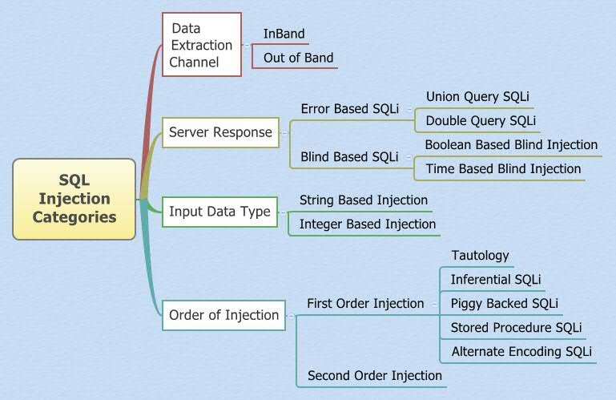
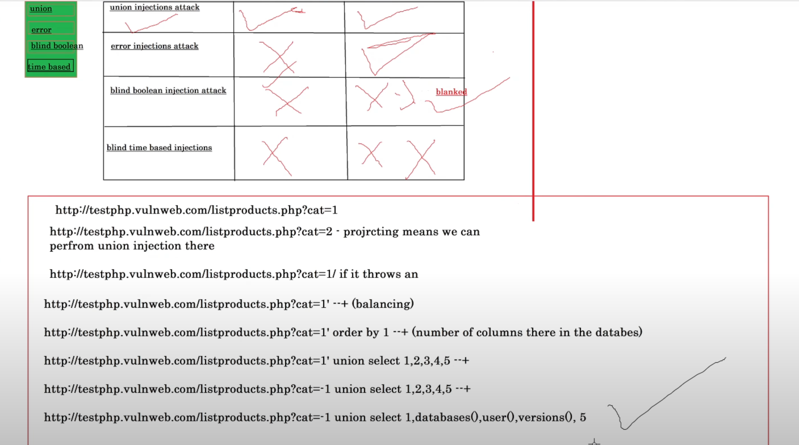
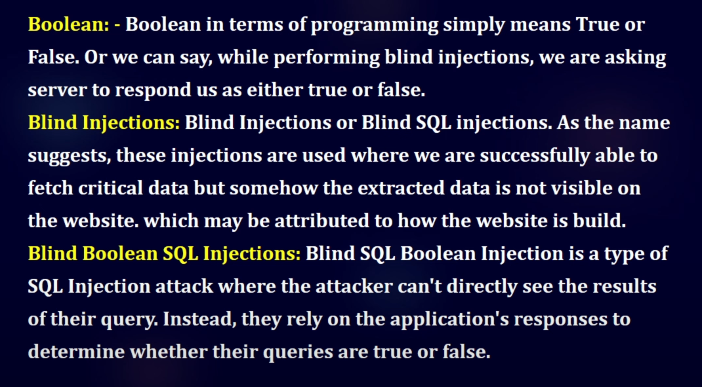
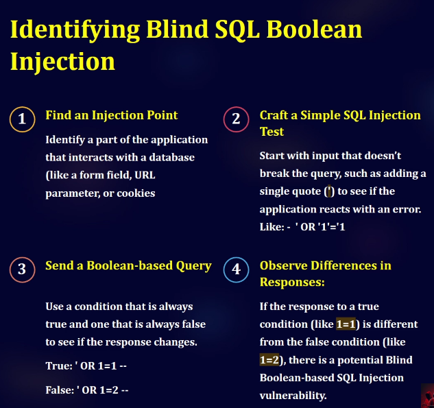
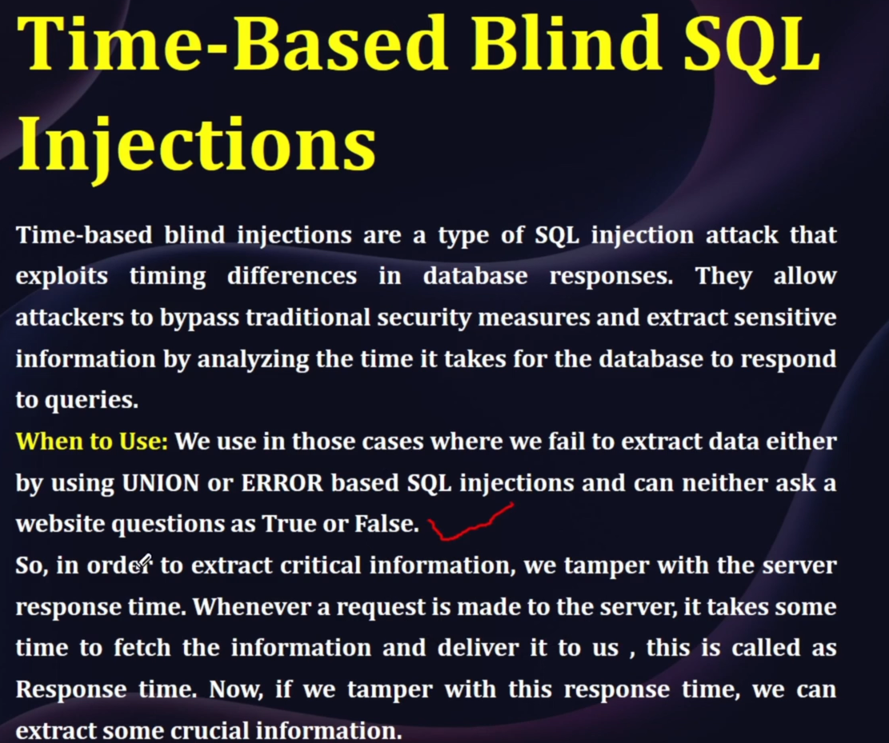
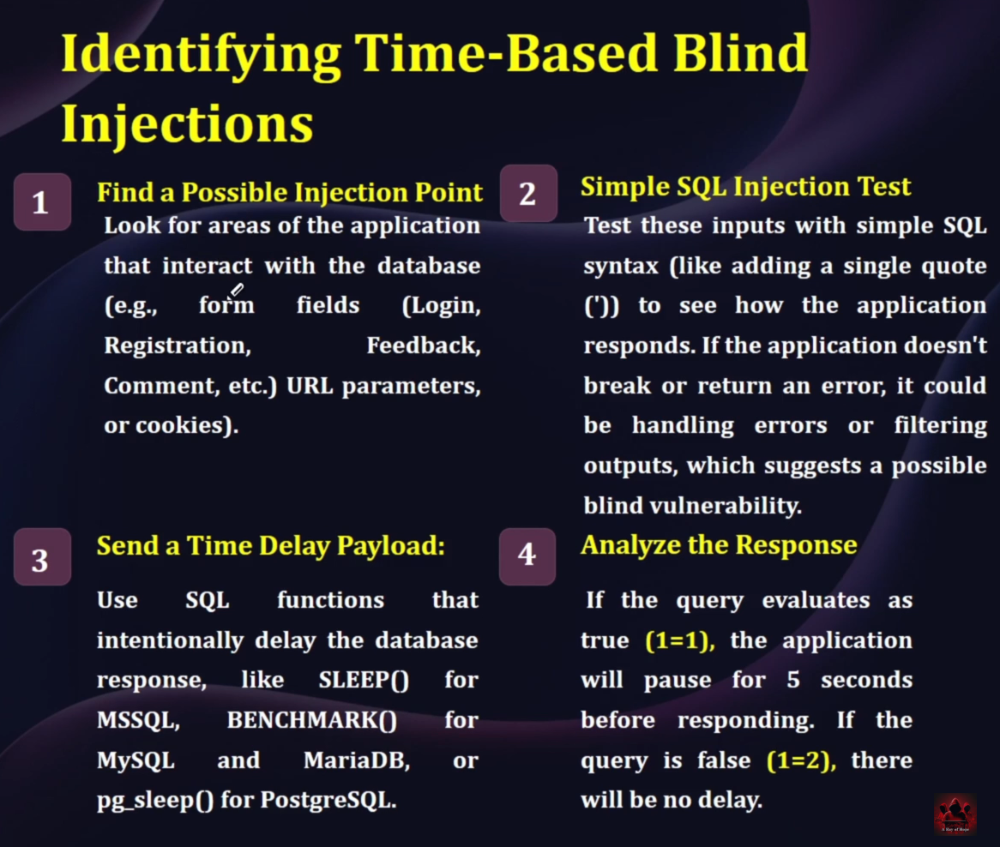

# SQLi - Injection

- **SQL injection:** is a code injection technique used fo aHack data-driven applications, in which malicious SQL statements are inserted into an entry field for execution (e.g. to dump the database contents to the Attacker).

- **SQL (Structured Query Language):** which is used to query data from the database. SQL helps web application in communicating with the database software to retrieve or store data from or in the database.

- **Database:** is the collection of data stored by a website in a particular format. This dafa could be all the application information like user information, messages, posts, comments, etc.

- SQL Server 
    - TCP Port - 1433, 4022, 135
    - UDP Port - 1434

#### SQLi Types 


#### Methodologies


### Lab Setup
- Lab Repo: https://github.com/Audi-1/sqli-labs
- Installation Steps: https://www.youtube.com/watch?v=53W8ZZlVKo0
- Accessing Labs: http://192.168.42.131/sqli-labs/

```
Time killed! **Ninja technique**  
OWASP-BWA : I used to host the SQLi-Labs so, it's not like normal metasploitable2 VM, root@localhost (Password: NO) won't allow to connect.  
OWASP-BWA : admin@localhost (Password: admin) update in sqli-labs/sql-connections/db-creds.inc 
Wasted time figuring out connection DB issues.
Be aware!
```

- SQLi - Hit and Trail  
- Write a query in a possibily wrong way which executes but gives a error.
- Ex: `http://192.168.42.131/sqli-labs/Less-1/?id=1` - Original SQL Query - Legitimate
- Here we have 4 methods to end query and start a new one aside : 1. `'`, 2. `')`, 3. `"`, 4. `")` these will help you break query
- Add some unkown value to do a operation to return error : `http://192.168.42.131/sqli-labs/Less-1/?id=1` Payload : `") order by 5000+--` 
- This gives a error no column 5000 which helps us to add further payloads and get db, os details and more.

### Blind - Boolean - SQLi 

#### Identify Injection

### Time based SQLi 

#### Identify SQLi
