# Cross Site Scripting (XSS)

Cross—site scripting is a web security vulnerability in which attacker inject malicious script into the website or web application. Whenever users access these websites via their browser then attacker executing malware whenever the site is loaded, thus attackers retrieve sensitive information from the users like cookie values, session tokens and other sensitive information.

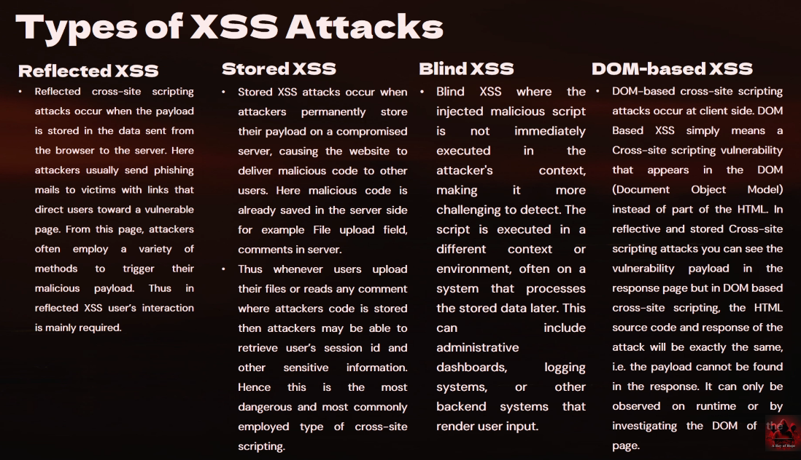

## Reflected XSS

- Reflected XSS: Interaction from the user required.
- When applications receives data from a untrusted source and includes the data within immediate responses in an unsafe way.

1. User Interaction
2. Website Response
3. Code Execution


###### Impact of XSS
- Data Theft
- Account Hijacking
- Malware Installation

###### Mitigations of XSS
- Input Validation
- Output Encoding
- Content Security Policy (CSP)

###- Hands-on DVWA
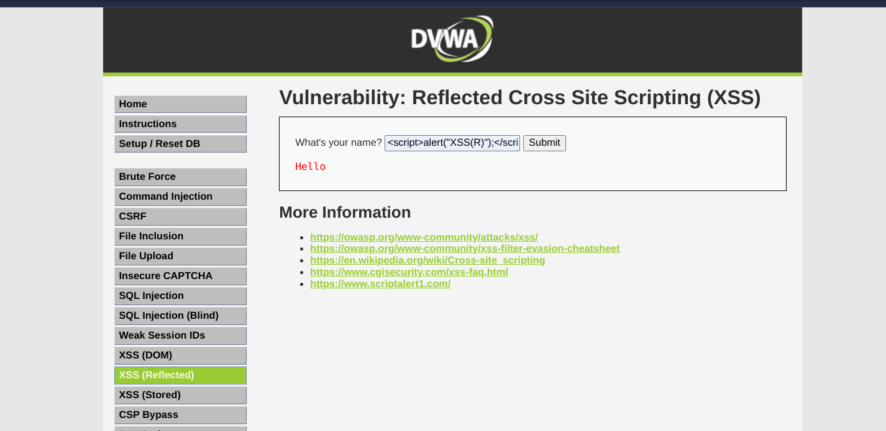
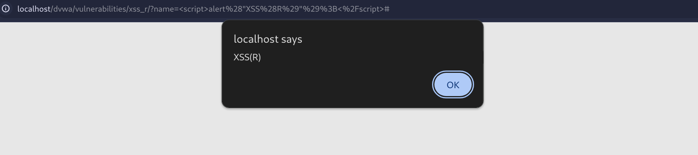
Submit the code - `<script>alert('XSS-Reflected');</script>`
### Reflected XSS Success!!!

### Some Tips
- If the webpage is allowing or executing the script blocks, but explicitly blocking the `<script>` tag, then we can use other methods/ payloads for getting things done...
1. `< script>alert (document. cookies) < / script >` - Spaces between `< >` can help.
2. `<noscript><p title="</noscript>">`
3. `` - alert on calling a non-existing source of the image.
4. `< input type="text" name="state" value="INPUT FROM USER" >`
5. `<IFRAME src=javascript:alert("Hackingmonks");"></IFRAME>`

```
<iframe <><a href=javascript&c010n;a1ert(document.cookie)>C1ick Here</a>=&gt;&lt;/iframe&gt;
"></iframe>')" / >
<a href="javascript&#x3ax=1;a1ert(1)">c1ick
AutoFocus r 'ale'%2B'rt'
">
```


## Stored XSS

Stored XSS arises when an applications receives data from an untrusted source and includes that data within its later responses in an unsafe way.
- Steal Cookie Info
- Session ID
- Dedicated Delivery of browser based attack.

##### Identify XSS
1. Vulnerable Parameters
2. Manual Code Review
3. Dynamic Content
4. Third-Party Libraries

#### Steps for Stored XSS
1. Attacker Finds Vulnerability
2. Attacker Injects Script
3. Script is stored
4. Victim Access Content
5. Compromised User Account

#### Impact of Stored XSS
1. Simple Script Injection
2. CSRF - Cross Site Request Forgery
3. Data Exfiltration
4. Browser Hijacking

#### Mitigations of XSS
- Input Validation
- Output Encoding
- Content Security Policy (CSP)
- Regular Security Updates


### Hands-On Stored XSS
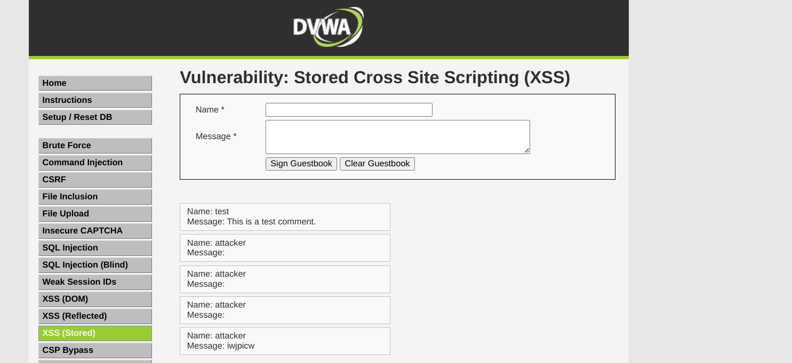
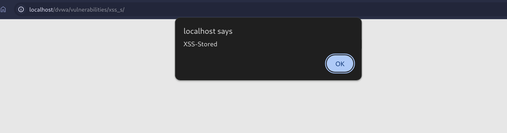
- We add script in the value that get's stored in the DataBase
- Whenever some user tries to access the page, the script get's executed.
### Stored-XSS Success!

## DOM XSS
A DOM-based XSS attack is possible if the web application writes data to the Document Object Model without proper sanitization the attacker can manipulate this data to include XSS content on the web page, for example malicious JavaScript code.
#### What is DOM:
DOM stands for Document Object Model; it's a model that browsers use to render a web page. The DOM represents a web page's structure; it defines the basic properties and behavior of each HTML element and helps scripts dynamically access and modify the page's content, structure, and style.
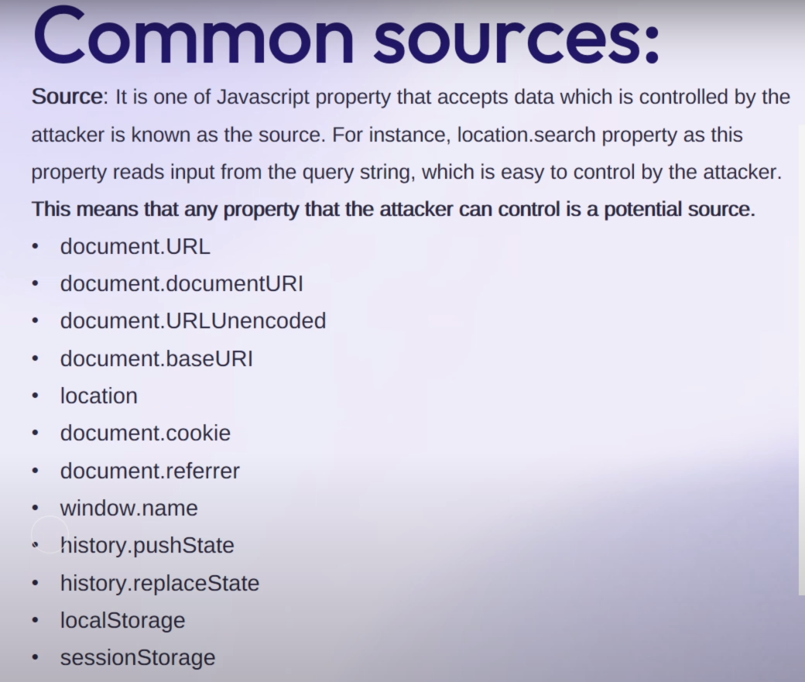
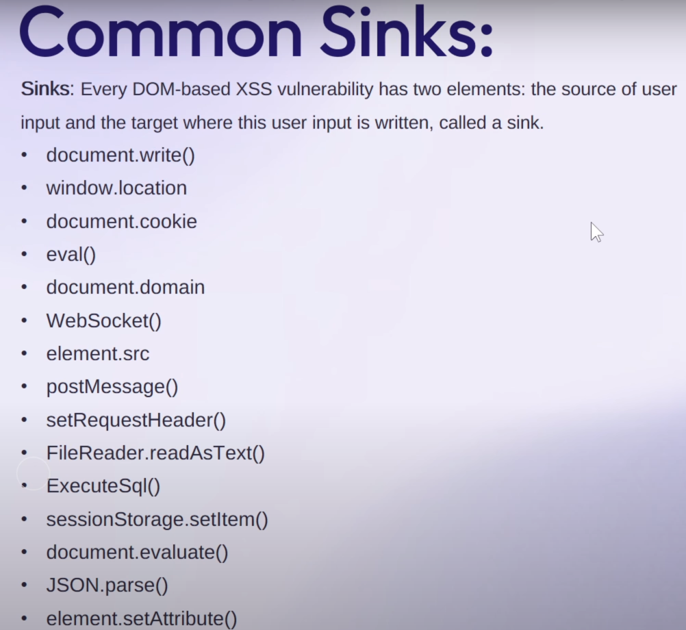
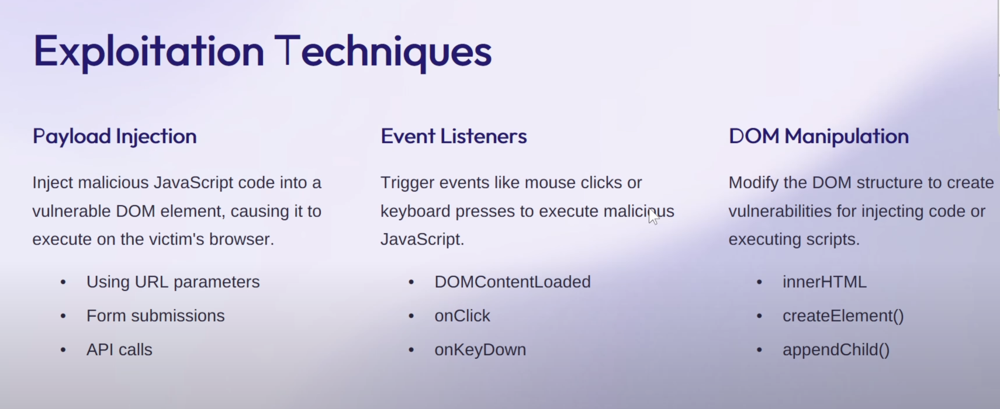

#### Impact of DOM-XSS
1. Data Theft
2. Account Hijacking
3. Website Defacement
4. Malware Distribution

#### Mitigations of XSS
- Input Validation
- Output Encoding
- Content Security Policy (CSP)
- Regular Security Updates


### Hands-on DOM-XSS
#### Low
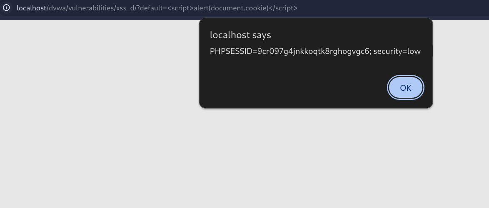
Payload - `http://localhost/dvwa/vulnerabilities/xss_d/?default=%3Cscript%3Ealert(document.cookie)%3C/script%3E`
> Sometimes - you think too much for a small thing and fail identifying it easily.

#### Medium
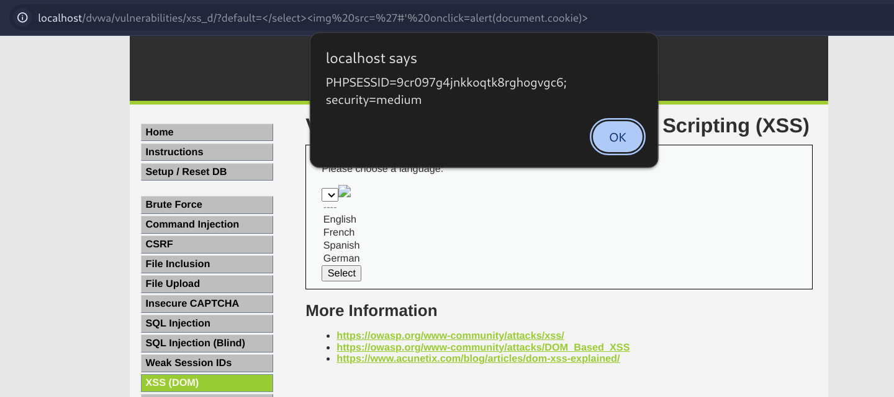
Payload - `http://localhost/dvwa/vulnerabilities/xss_d/?default=</select>`

#### High
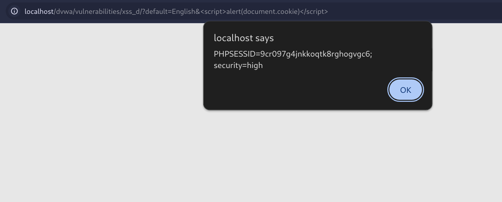
Payload - `http://localhost/dvwa/vulnerabilities/xss_d/?default=English&<script>alert(document.cookie)</script>`

References: https://medium.com/hacker-toolbelt/dvwa-1-9-xss-dom-ae1a29018f66

## Blind XSS
> Server Side Vulnerability
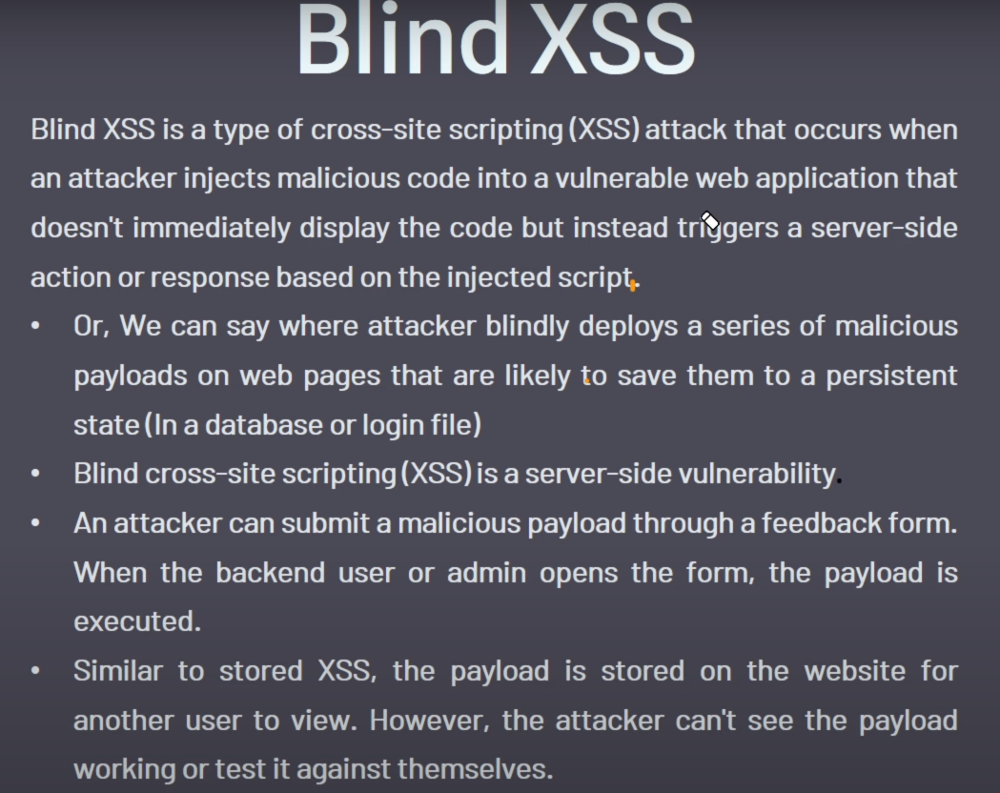
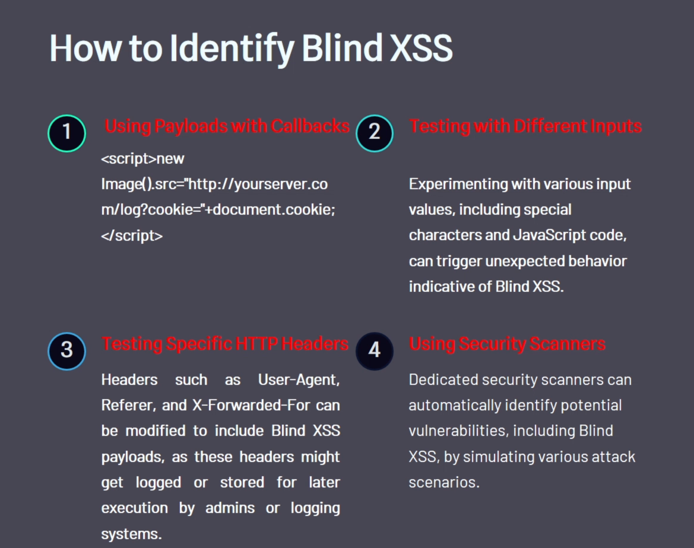

#### Exploit Blind XSS
1. Inject Malicious Script
2. Server-Side Execution
3. Data Manipulation or Information Disclosure

#### Mitigations of XSS
- Input Validation
- Output Encoding
- Content Security Policy (CSP)
- Regular Security Updates

Tool - https://xsshunter.trufflesecurity.com/

## BWAPP    
#### XSS - Reflected (GET) - Low
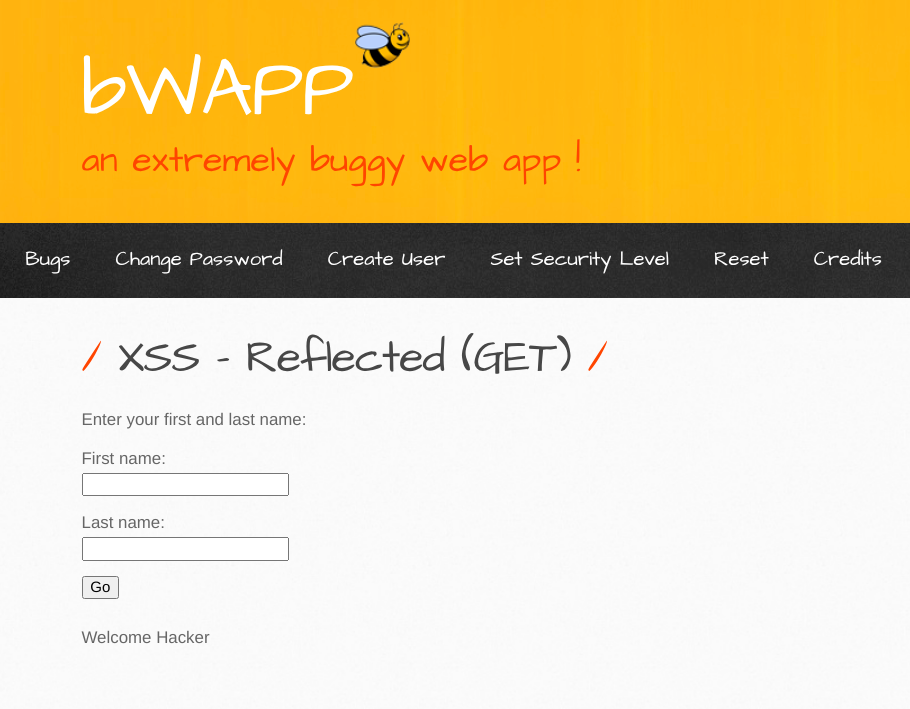
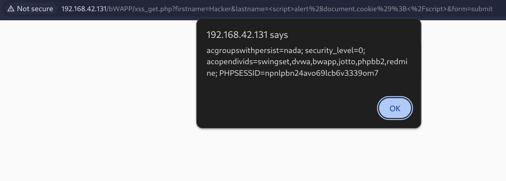
Payload Firstname - `<script>alert('XSSREFGET')</script>` Lastname - `<script>alert(document.cookie)</script>`

```
Also, when you write strings in the alert('') prefer not to test with strings particularly instead use values inside alert like "document.cookie", numerical int, coz (',',",",) these quotes, double-quotes can actually invite unintentional errors in the payload, on the other hand values with no quotes have lesser chance of having false errors, which gives better chance for testing the application security and application errors than the payload errors.
```

- _Happy XSS Hacking_