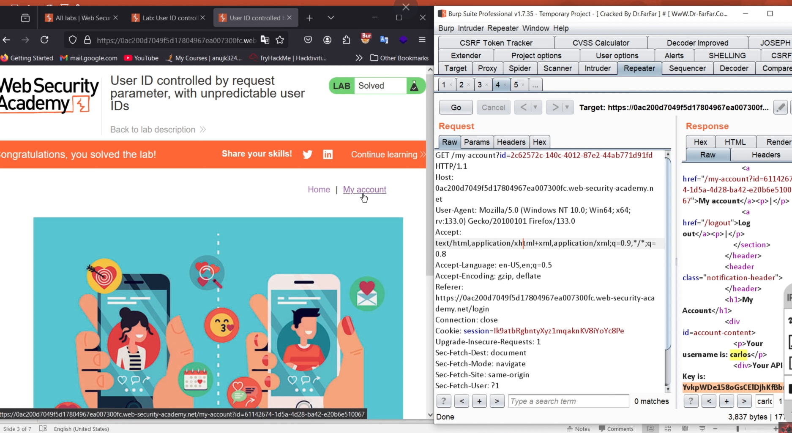

# Broken Access Control - BAC

Broken access control is a security flaw that allows users to bypass access restrictions and perform actions they shouldn't be able to. This can lead to serious security breaches, such as unauthorized access to sensitive information.

### Types:
1. Horizantal Access Control - Same Privilige Level
2. Vertical Access Control - Higher User Privilige - Admin/superuser
3. Context Dependent Access Control - 

### Mitigations
1. Strong Auth - CIA
2. Mechanisms like Session Management, RBAC, Token Validation
3. Deny Access by default.

### One of the favourities!!! @DPRIYATHAM

### Hands-ON
