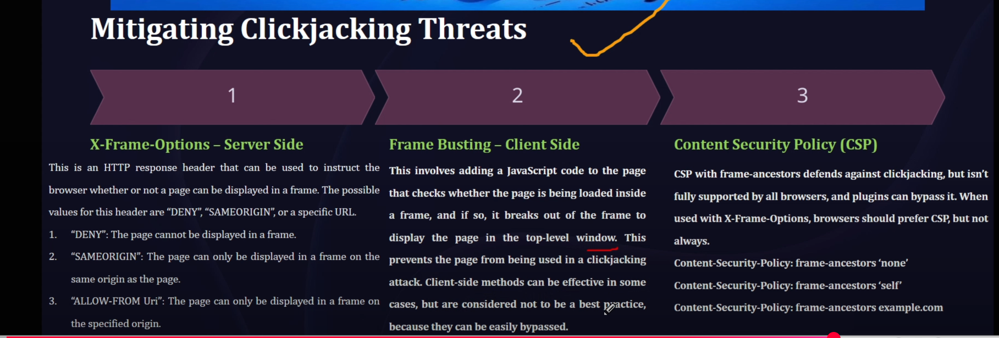

# ClickJacking

#### Identifying Clickjacking
- Security Headers Missing : If application is not using security headers like Content Security Policy, and X-Frame Options.

### Types of Clickjacking

### Mitigations of Clickjacking
