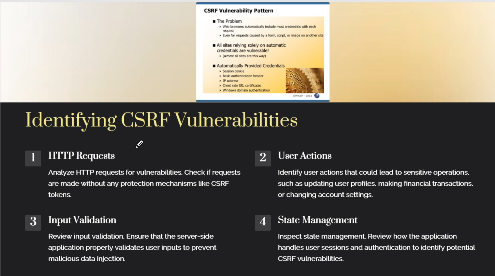
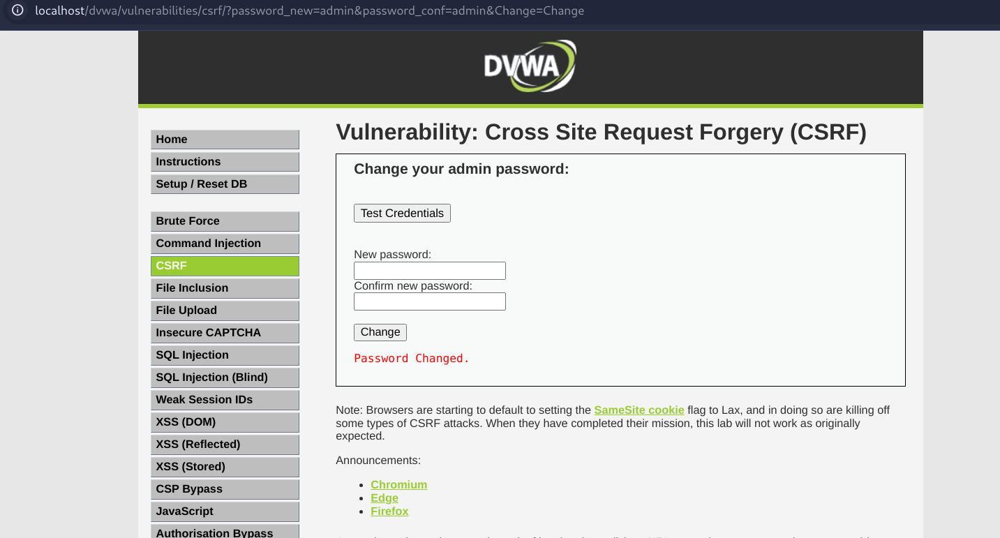

# Cross Site Request Forgery - CSRF
Cross-Site Request Forgery (CSRF) is a type of web security vulnerability that allows attackers to induce users' web browsers to perform unwanted actions on a trusted site when the user is authenticated. This happens without the user's knowledge or consent.  
OR  
Cross site request forgery (CSRF), also known as XSRF, is an attack vector that tricks a web browser into executing an unwanted action in an application to which a user is logged in.

### Identify CSRF

### Exploiting CSRF Attacks
1. Malicious Link (URL)
2. User Interaction
3. Unauthorized Action

### Mitigations of CSRF
1. CSRF Tokens
    - This is a good method but not 100% secure, XSS attacks can be used to steal these tokens and perform CSRF.
2. HTTP Strict Transport Security (HSTS)
3. Samesite Cookies
4. Input Validation

### Hands-On

- Payload (URL) : `http://localhost/dvwa/vulnerabilities/csrf/?password_new=admin&password_conf=admin&Change=Change`
- We send the victim this link which resets the passwords for the pre-set password we gave in the link `admin@admin`, once it executed, we login to the victim account and reset the password to another password, and the user looses access to his account.
- Reference: https://medium.com/@preranakhanal42/csrf-dvwa-walkthrough-106b318c7b1f

#### Success!!!