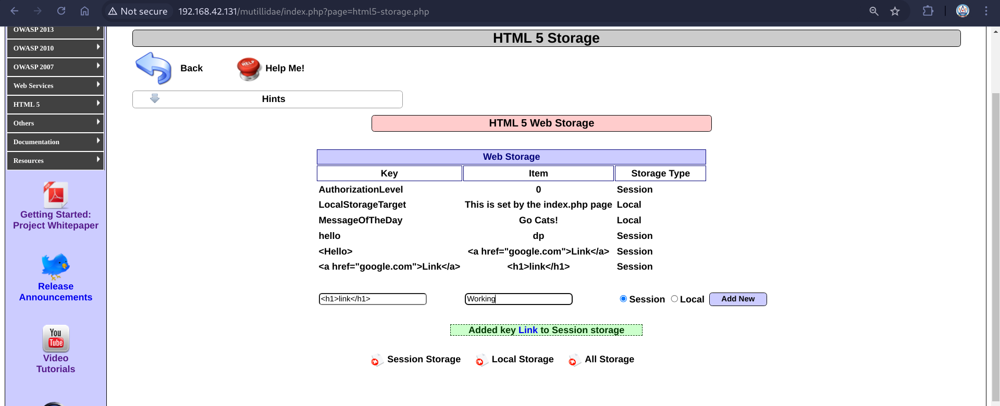

# HTML Injections 
HTML Injection also known as Cross Site Scripting. It is a security vulnerability that allows an attacker to inject HTML code into web pages that are viewed by other users.

Attackers often inject malicious JavaScript, VBScript, ActiveX, and/or HTML into vulnerable applications to deceive the user in order to gather data from them.  Cross-site scripting (XSS) vulnerabilities can be used by attackers to bypass authentication controls there by gaining access to sensitive data on your system. Well crafted malicious code can even help the attacker gain access to the entire system.

### Example Of Html Injection
- First the attacker finds out a site which is vulnerable to HTML injection
- Then the attacker sends the URL with malicious code injected in the URL to the victim user either through email or some other mechanism.
- If the victim user click this malicious URL, it will run the JavaScript or VBScript code with the privileges of the victim user.
- Depending on the code being executed it can give out sensitive information of the user or even compromise the victim’s computer.

###### Example 
1. **Identify User Input Fields in the URL**:
   - Many web applications take parameters from the URL, such as search queries, user IDs, or other input. Look for URLs that contain query parameters like ?id=, ?search=, ?user=, etc.
   - Example: https://example.com/search?q=shoes

2. **Add payloads to the URL**
    - Ex: `https://example.com/search?q=`
    - Ex: `https://example.com/search?q=`

> Try to send any HTML code snippet through the params, if the code is executed, the website have the particular vulnerability.

###### Common Issues
1. Lack of Input Validation
2. Improper Sanitization
3. Dynamic Content Generation
4. Lack of Proper Encoding

###### Redemption
1. Proper Validation
2. CSP - Content Security Policy

### Hands-On - 1
Let's practice with **Mutillidae** (OWASP-BWA) - http://192.168.42.131/mutillidae/  
Go to `OWASP 2013 > A1 Injection (Other) > HTML Injection` there are multiple labs.  
- http://192.168.42.131/mutillidae/index.php?page=browser-info.php

1. Let's work on the Browser Info Lab - Let's test for HTMLi 

2. Setup Burpsuite to intercept the parameters

- Tested changing the `page` parameter with `` but it was not successful.
- After careful inspection, `User Agent` value seems to be a param, let's try it out.

We have updated the `User Agent` value to ``

We can see that the code that is sent through `User Agent` is executing successfully.

We can even update it with malicous links like `<a href="https://www.malicious.com">Visit Trusted page!</a>`

### Success!!!

### Hands-On - 2
Go to `OWASP 2013 > A1 Injection (Other) > HTML Via Cookie Injection > Capture Data Page` 

- Here we can clearly see the `PHPSESSIONID`
- Let's intercept and use it, but this time let's try to redirect it to another page.
- PHPSESSID=`<meta http-equiv="refresh" content="5; URL=https://www.facebook.com"/>COOKIE_VALUE`
- Redirected to `Facebook` after 5 Seconds

### Success

### Hands-On - 3

- Play with the input values.

- We are able to add code snippets which are being executed and stored, when user visits - they will see it.

### Success