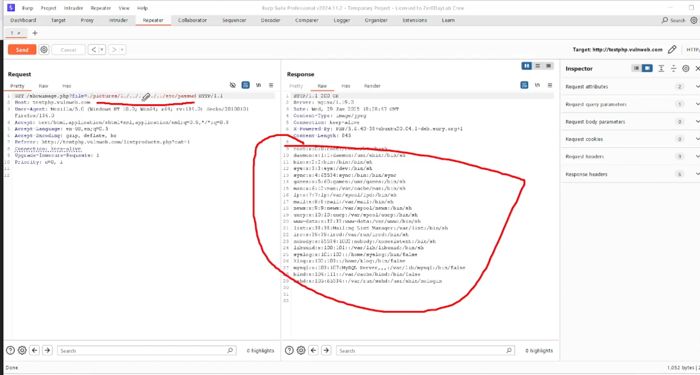

# Path / Directory Traversal Attacks

A "Path Traversal Attack" (also known as a "Directory Traversal Attack") is a cyber security vulnerability that allows attackers to access files or directories outside of the intended web application directory by manipulating file path variables, essentially letting them read sensitive files like configuration files, system files, or source code that they shouldn't have access to.     

### Identify Path Traversal

- Identify the server of the application windows/linux - osint tools or `nmap -sV`

### Impact of Path Traversal
1. Information Disclosure
2. Remote Code Execution
3. Data Manipulation
4. Privilige Escalation

### Mitigations
1. Input validation and sanitization
2. Canonicalization (Absolute path, Relative Path)
3. Least Privilige Principle
4. Error Handling

### Hands-ON

### Directory Listing - Mitigations

### Impact of Directory Listing
1. Information Disclosure
2. Source Code Exposure
3. Data Breaches
4. Reputation Damage    

#### Practice - http://testphp.vulnweb.com/