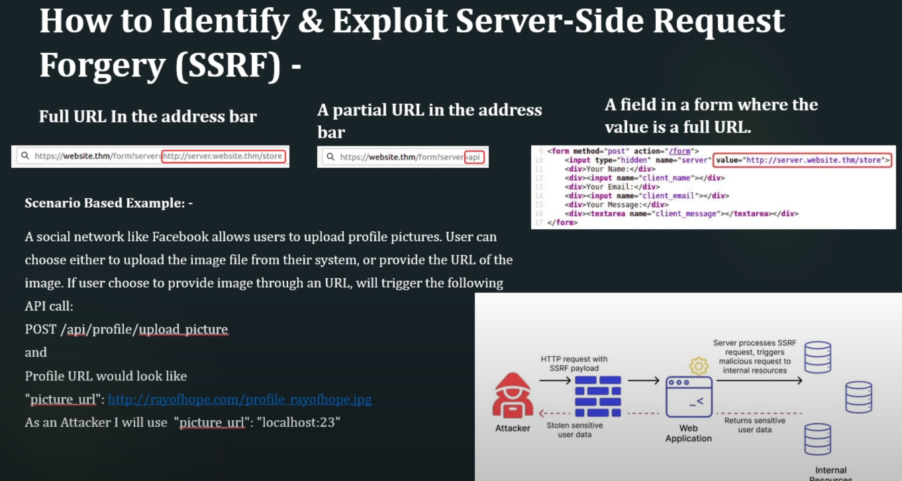
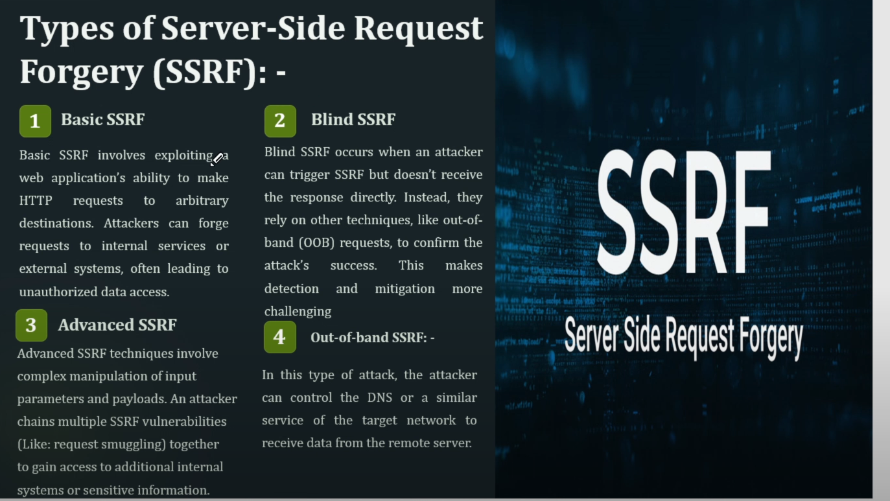

# Server Side Request Forgery - SSRF

Server-Side Request Forgery (SSRF) is a security vulnerability that occurs when an attacker force an external server or victim server to create HTTP requests on behalf of the user. This happens because the application accepts user input to form a URL request and fails to validate or restrict it properly. A hacker could trick the server into fetching sensitive data from internal systems or even performing actions like deleting files. Cross-Site Port Attack (XSPA) is also a part of SSRE In XSPA, an attacker can scan the open port of a targeted web  server with the help of a vulnerable web application which is processing the user's URL.

### Identify SSRF

### Types of SSRF

### Mitigations of SSRF
1. Whitelist-based Filtering
2. Firewall and Network Segmentation
3. Input Validation
4. Blocking Private IP Range

