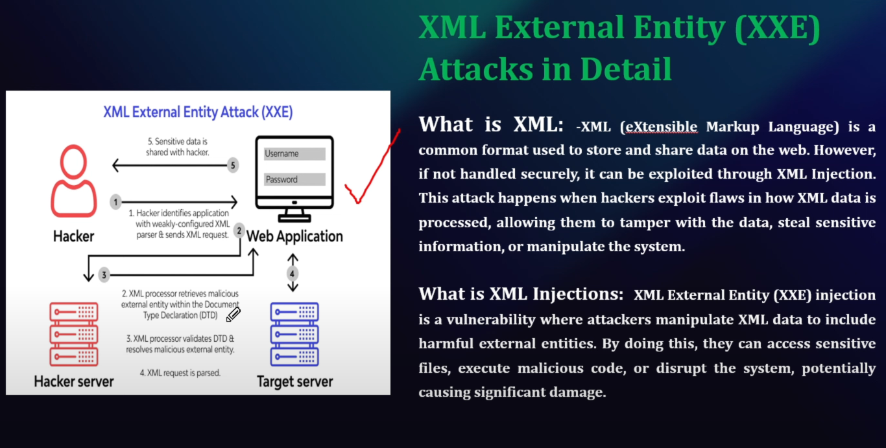
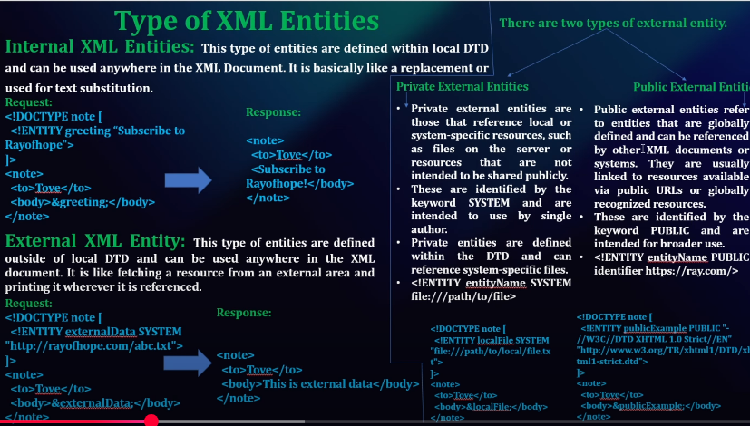
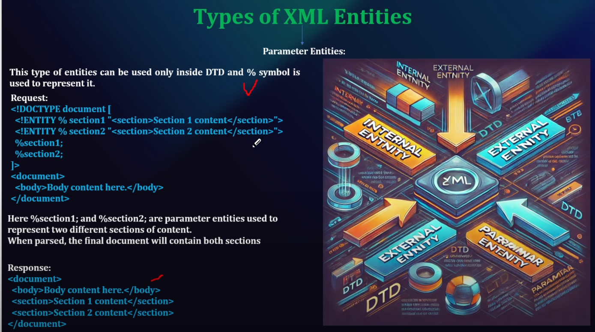
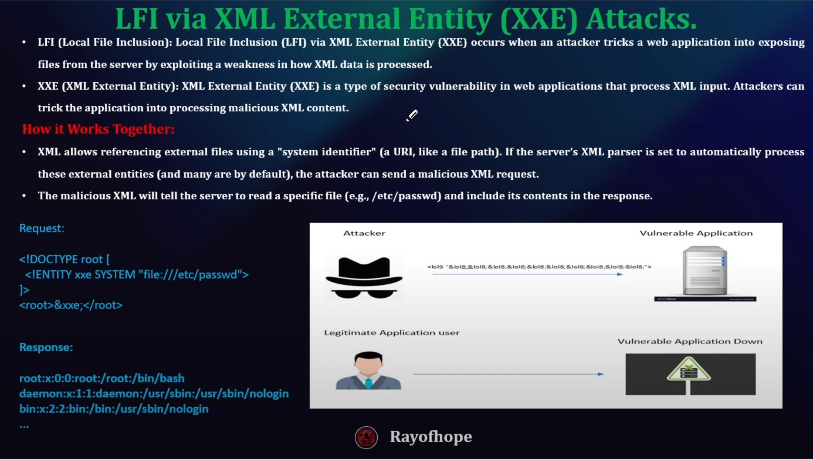
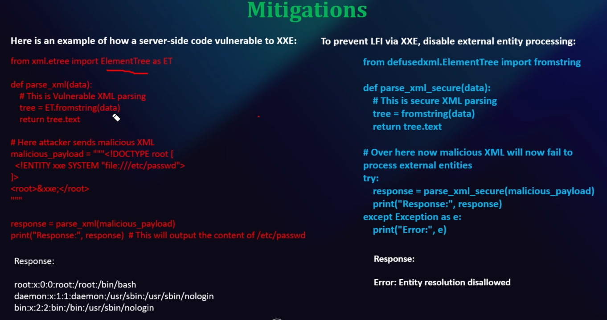
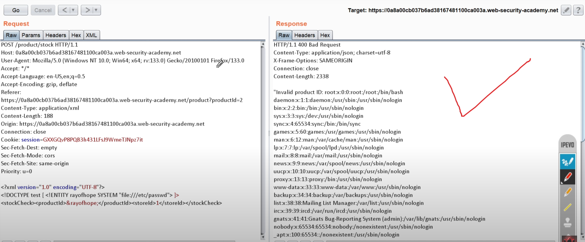

# XML External Entity - XXE

#### 3 Types of XML Entities
1. Internal 
2. External
3. Paramater

- Blind XXE
    - The attacker cannot directly see the response but can infer information based on the server's response time or error messages.
- In-Band XXE
    - The attacker sends an XML request and receives a response containing the requested data, allowing them to retrieve sensitive information.
- Out-of-Band XXE 
    - The attacker uses the XXE vulnerability to exfiltrate data to a remote server they control, bypassing traditional security.

### Mitigations
1. Disable External Entities
2. Input Validation and Sanitization
3. Limit XML Parsing Permissions

## Payloads  - https://github.com/swisskyrepo/PayloadsAllTheThings
### Encode - https://urlencoder.org

### LFI - Local File Inclusion

### Mitigations - defusedxml package

`content-type: application/xml`

### Hands-on
