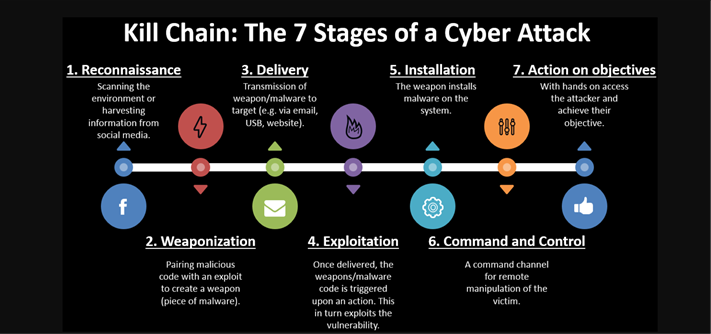
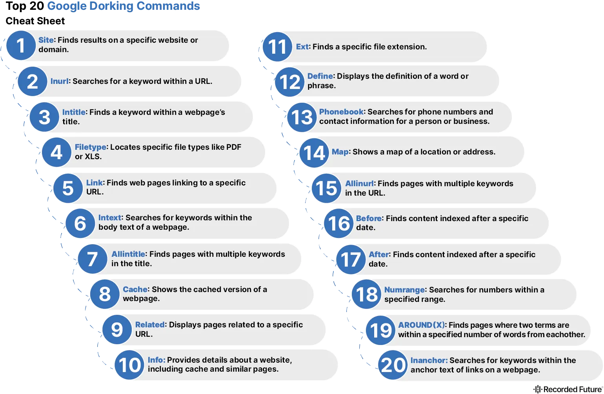
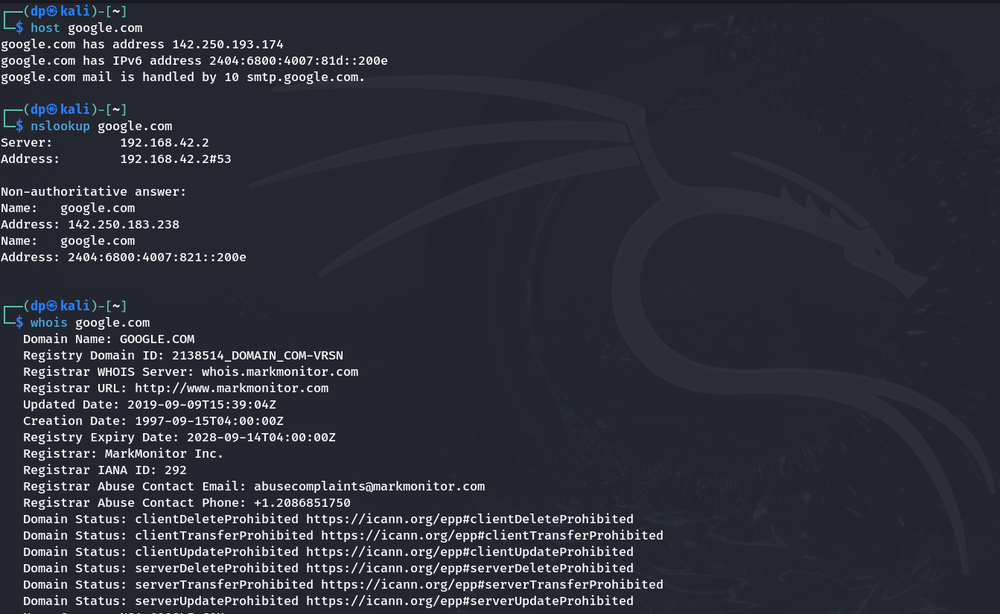

# Bug Bounty
A bug bounty program, also called a vulnerability rewards program (VRP), is a crowdsourcing initiative that rewards individuals like ethical hackers and security researchers for discovering and reporting vulnerabilities and bugs in software.

### Popular Bug Bounty Programs:
1. Bugcrowd
2. Hackerone
3. Synack
4. Bugbounter
5. Yes We Hack  

#### Bugs in the Scope
1. SQL Injections
    1. Blind
    2. Union
    3. Error
2. (XSS) Cross Site Scripting Injections 
    1. Stored
    2. DOM
    3. Reflected
3. (IDOR) Insecure Direct Object References
4. (BAC) Broken Access Control 
    1. Horizontal
    2. Vertical
5. Security Misconfiguration
6. (CSRF) Cross Site Request Forgery
7. Brute Forcing
8. 2FA — 2 Factor Authentications Bypass
9. Response Manipulation
10. File Inclusion
11. URL Redirect
12. SSRF — Server Side Request Forgery
13. HTML Injections
14. Clickjacking
15. API S3 Bucket
16. Business Logic
17. Information Disclosure
18. Zero Day Vulernabilties

### Cyber Kill Chain

- Information Gathering and Reconnaissance - More the Information you have more success rate.

### Information Gathering 

###### But What Information to gather?  
1. Technology Info about the website - Tech Stack, Versions etc..
2. Critical assets and web application that belongs to the clients.
3. Subdomains and Domains related to the target website.
4. Live and Dead URLs.
5. Server Architecture of the domain.
5. Other Web applications running on the same server as the target domains.
6. Critical cached pages.
7. Other Snapshots of the applications.

###### Digital Footprinting
- IP Address 
- Location 
- Preferences, Address while shopping
- Cards Info

###### Information Gathering Tools:
1. Wappalyzer - Tech Stack of the website
2. Virustotal - Malware on the website 
3. nmmaper/dnsdumpster - DNS recon, Subdomains - Look for Host Records (A) 
4. builtwith - Programming Language, Hosting details
5. Wayback Machine - History of the Website
    - Search Subdomains: `web.archive.org/cdx/search/cdx?url=*.deere.com&output=text&fl=original&collapse=urlkey`
6. Google Dorking and Google Hacking Database (GHDB)

7. Information Gathering about Company's and Employee's details
    1. TrueCaller
    2. Social Media Platforms - Facebook, X, Instagram, LinkedIn...
    3. Company Reviews - Glassdoor, Indeed...
    4. Financial Status - Wikipedia, Wellfound, Crunchbase...
8. Whois - DNS Lookup...
9. `whatweb` Linux Tool - Tech Stack, Versioning...

###### Website Enumeration
> Tools: https://infosecwriteups.com/website-and-ip-enumeration-tools-list-e55c71e21a41

### Practice
- Let's practice using `DVWA`, `OWASP-BWA`. - [Click Here](Practice)

> Reference: https://www.youtube.com/@arayofhope7