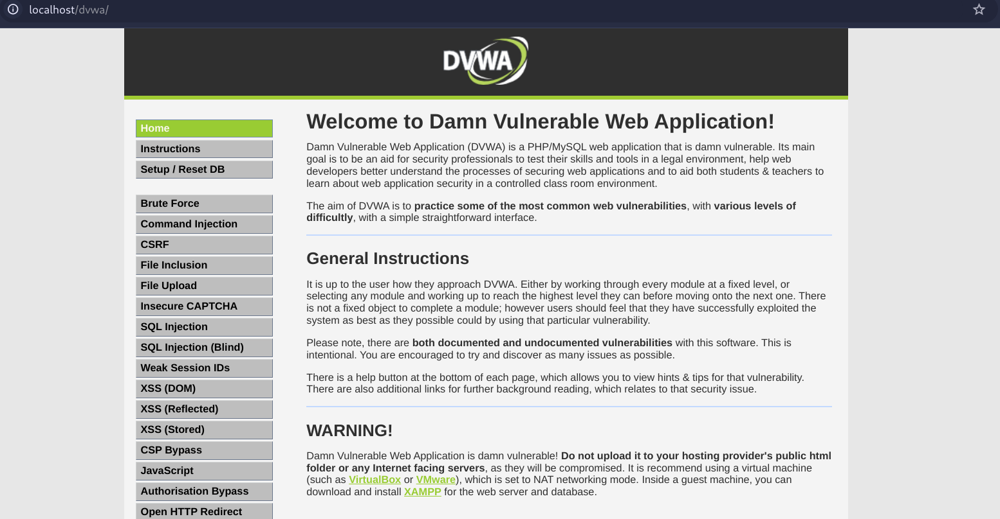

# DVWA

### Installing XAMPP - Kali Linux
- `sudo chmod +x xampp-linux-x64-8.2.12-0-installer.run`
- `sudo .\xampp-linux-x64-8.2.12-0-installer.run`
- Modules and Files are installed under the "/opt/lampp" directory.
- Visit `localhost/dashboard` in your browser to access xampp
- Easy access in terminal `nano ~/.zshrc`,  `alias xampp="sudo /opt/lampp/manager-linux-x64.run"`, `source ~/.zshrc`
- Restart terminal, `xampp` is all set to use.
- Start the servers.
> If you face issue in starting any servers, `systemctl stop mysql/apache` in the vm so xampp can run them.

### Setup DVWA
- Download `dvwa` and move the extracted folder to `/opt/lampp/htdocs`
- Rename the `dvwa/config/config.inc.php.dist` to `dvwa/config/config.inc.php`
- Update `config.inc.php`
```
$_DVWA = array();
$_DVWA[ 'db_server' ]   = getenv('DB_SERVER') ?: '127.0.0.1';
$_DVWA[ 'db_database' ] = getenv('DB_DATABASE') ?: 'dvwa';
$_DVWA[ 'db_user' ]     = getenv('DB_USER') ?: 'dp';
$_DVWA[ 'db_password' ] = getenv('DB_PASSWORD') ?: 'dp';
$_DVWA[ 'db_port']      = getenv('DB_PORT') ?: '3306';
```
- Setup the dvwa database: http://localhost/dvwa/setup.php
- Instructions for setting up new user and granting priviliges on Database - http://localhost/dvwa/instructions.php
    - CLI Approach  - https://www.youtube.com/watch?v=dabm-7CcHaE
    - GUI Approach - https://www.youtube.com/watch?v=DDxYJfVAVJA visit http://localhost/phpmyadmin/
    - Follow the dbanme, username, password etc.. values  in the config file **only**.
- Make sure you provide neccessary priviliges - `sudo chmod -R 777 /opt/lampp/htdocs/dvwa`
> !!!TIME KILLED!!!  
> DB_USER dp:dp when you setup/reset DB - user table values are updated, to login use **"admin:password"**

### Finally Setup Done!!!


> - Download DVWA: https://github.com/digininja/DVWA
> - Download XAMPP: https://www.apachefriends.org/
> - Installing on Kali Linux XAMPP, DVWA... - https://www.youtube.com/watch?v=JkCuCf41aYc