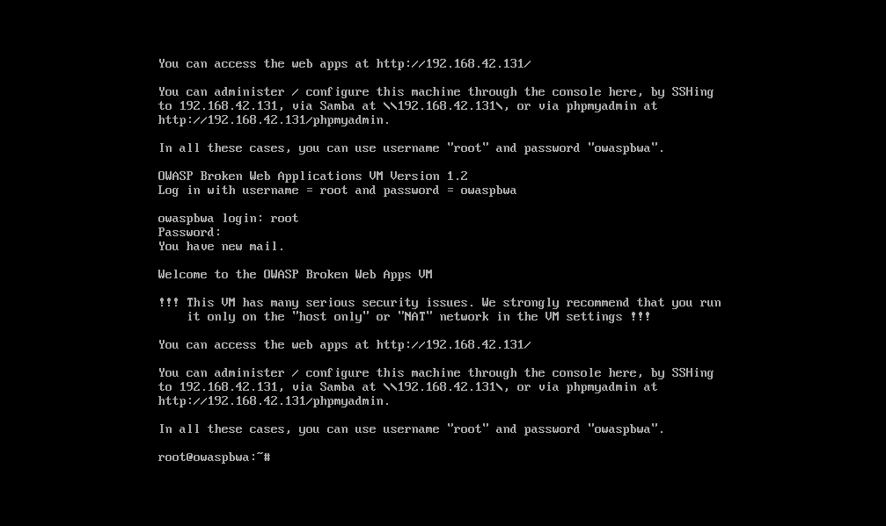
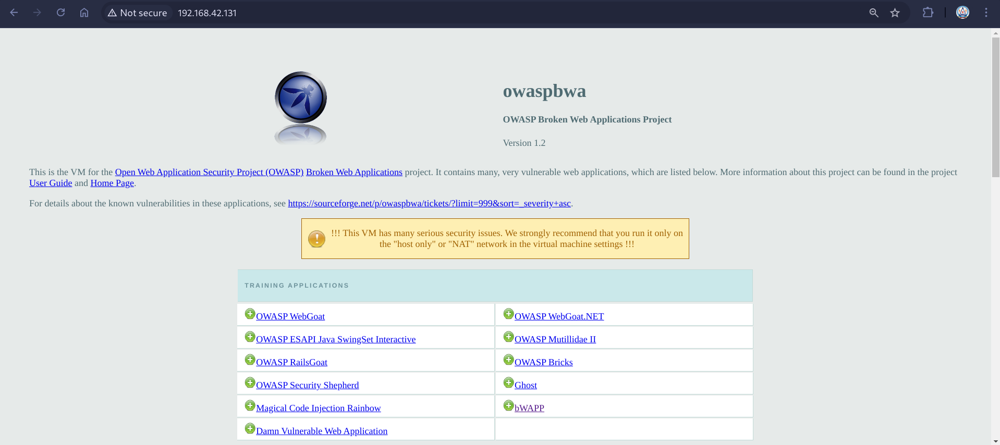
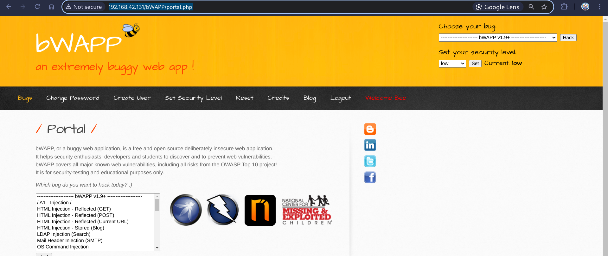
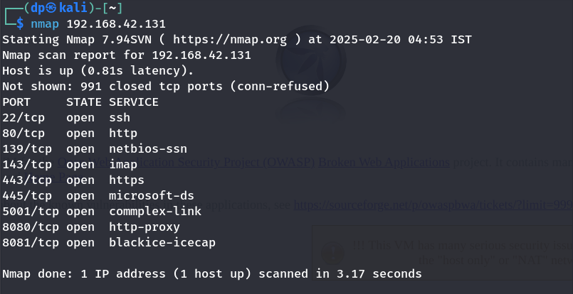

# OWASP Broken Web Applications Project

- Download OWASPBWA
- Open OWASPBWA with VMware and setup
- Access the OWASPBWA - http://192.168.42.131/
- We can access the same in the another VM running Kali Linux
    - SSH : `ssh -o HostkeyAlgorithms=+ssh-rsa root@192.168.42.131` 
- PhPmyadmin: http://192.168.42.131/phpmyadmin/ - further configuration.

- Access the OWASPBWA on Kali Linux- http://192.168.42.131/

- Access bWapp from there - http://192.168.42.131/bWAPP/portal.php

### Nmap Scan
- Normal Scan (1000 Ports): `nmap 192.68.42.131`
- Vulnerbaility Scan - `nmap --script vuln 192.168.42.131`

> Nikto is an Open Source software written in Perl language that is used to scan a web-server for the vulnerability that can be exploited and can compromise the server. 

> Download OWASPBWA https://sourceforge.net/projects/owaspbwa/