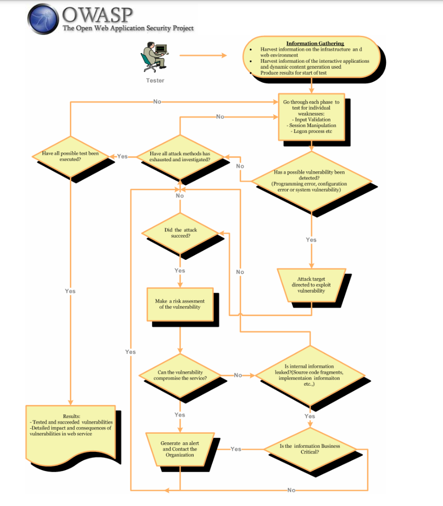
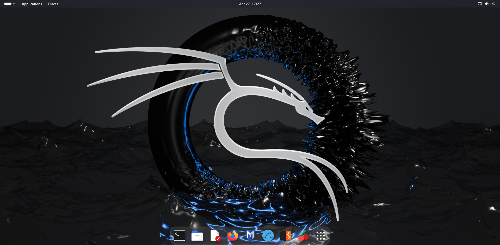

# Vulnerability Assessment and Penetration Testing
This documentation contains the approach and steps needed for VAPT.

##### Testing Techniques
1. Manual Inspections & Reviews  
    Manual inspections are human reviews that typically test the security implications of people, policies, and processes. Manual inspections can also include inspection of technology decisions such as architectural designs.
2. Threat Modeling  
    It can be seen as risk assessment for applications. In fact, it enables the designer to develop mitigation strategies for potential vulnerabilities. It is recommended that all applications have a threat model developed and documented. (As early as possible in SDLC)
3. Code Review 
    Source code review is the process of manually checking the source code of a web application for security issues. Many serious security vulnerabilities cannot be detected with any other form of analysis or testing. As the popular saying goes “if you want to know what’s really going on, go straight to the source.”
4. Penetration Testing 
    Penetration testing will never be an exact science where a complete list of all possible issues that should be tested can de defined. Indeed penetration is only an appropriate technique to test the security of web applications under certain circumstances.

### Flow Diagram for VAPT

1. Gather all the possible Information
2. Follow the different phases
3. Exploit all the vulnerabilities 
4. Use the output of a vulnerability to re-asses application
5. Report the Vulnerabilities

OWASP Web Application Penetration Checklist - [Link](https://owasp.org/www-project-web-security-testing-guide/assets/archive/OWASP_Web_Application_Penetration_Checklist_v1_1.pdf) => RFP Template, Benchmarks, Testing Checklist

### Lab Setup
Linux Distribution => Kali Linux (Debian) - [Download](https://cdimage.kali.org/kali-2024.1/kali-linux-2024.1-installer-amd64.iso) 
Hypervisior => VMware Workstation 17 Player - [Download](https://customerconnect.vmware.com/en/downloads/details?downloadGroup=WKST-PLAYER-1751&productId=1377&rPId=117008) 
Using Metasploitable for testing purpose - [Download](https://docs.rapid7.com/metasploit/metasploitable-2)  

**Rule 1:** Always use a Virtual Machine to do VAPT. 
Reason for using VM:
1. Isolation from Host OS 
2. Easy to configure, and test accross different versions
3. Easy to work on networks, saving state.

### Aim
Gain the Control over Application & Database
> If you can't gain control over application, gain control over the programs in the computer (server), exploit computer.  
> If nothing works, exploit humans(admins, maintainers) social engineering attacks, side-channel attacks.

### Information Gathering

**Rule 2:** More Information => More Attack Surface  

1. Use `Robtex DNS` lookup under “names pointing to same IP”.
2. Using `bing.com`, search for ip:"target ip".
3. `Knock` can be used to find subdomains of target
    1. Download it > git clone https://github.com/guelfoweb/knock.git
    2. Navigate to knock.py. > ce knock/knock.py
    3. Run it > python knock.py [target]
4. Find files & directories in target website tool => dirb `> dirb [target] [wordlist] [options]`
5. Maltego is an information gathering tool that can be used to collect information about ANYTHING. `maltegoce`
6. Domain tools - IP information about our Target website => [whois.domaintools.com](https://whois.domaintools.com/) & [Robotex](https://www.robtex.com/)
7. Netcraft - information regarding IP, Tech Stack, Deployment, Geolocation details => [Netcraft](https://sitereport.netcraft.com/)

### Preparation
1. Login to metasploitable2 > msfadmin/msfadmin
2. `ifconfig` > Get the IP address of the Metasploitable
3. Setup Kali Linux => The attack machine

### Vulnerabilities

**Rule 3:** DIE (Discover - Intercept - Exploit)

#### OWASP TOP 10 Web Application Security Risks

Other Web Vulnerabilities - [Link](https://drive.google.com/file/d/1T_kTLNWVA2uhPcZaVSVrbr2CveY8M3Hp/view)

### Some Useful Links:
1. OWASP Cheatsheet - [Documentation](https://cheatsheetseries.owasp.org/index.html)
2. Metasploitable is an 'intentionally vulnerable virtual machine' by Rapid7 - [Documentation](https://docs.rapid7.com/metasploit/quick-start-guide)
3. Detailed Linux Commands Explaination - [Explainshell](https://explainshell.com)
4. DAMN VULNERABLE WEB APPLICATION (DVWA) - [GitHub](https://github.com/digininja/DVWA)
5. VAPT Documentation by [Revanth](https://github.com/K-REVANTH) - [Document](https://docs.google.com/document/d/12U0AGqMa1BVCar6eaP-_AgwEXOc4ZQS8X7w1Qu2BDmw)
6. OWASP Testing Guide - [Book](https://owasp.org/www-project-web-security-testing-guide/assets/archive/OWASP_Testing_Guide_v4.pdf)
7. Guide for VAPT Analysis 